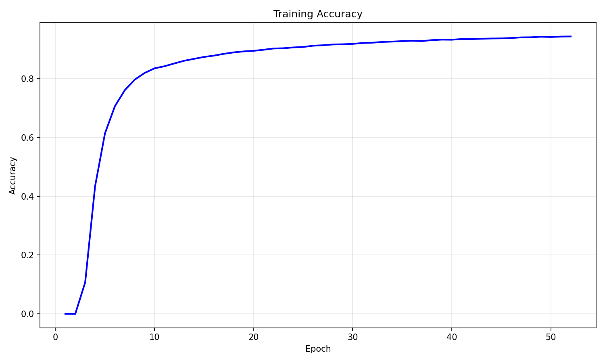
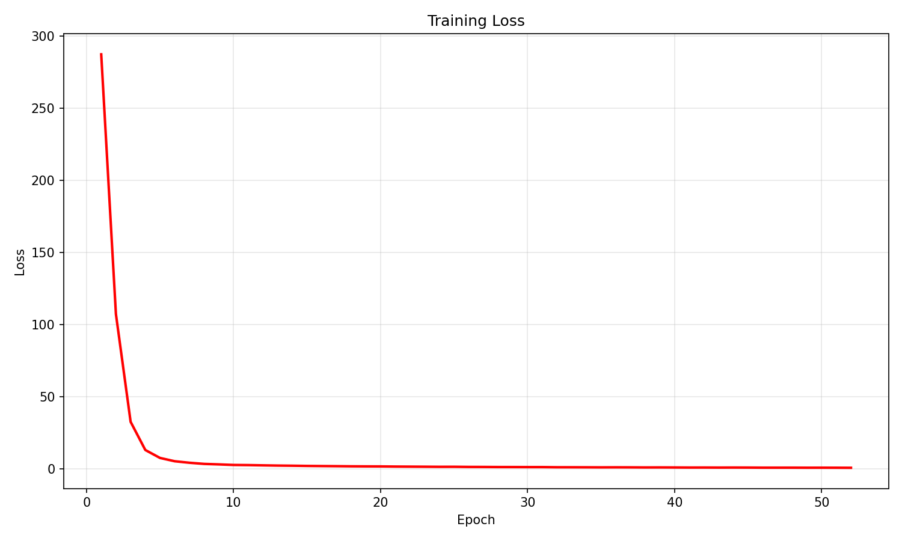
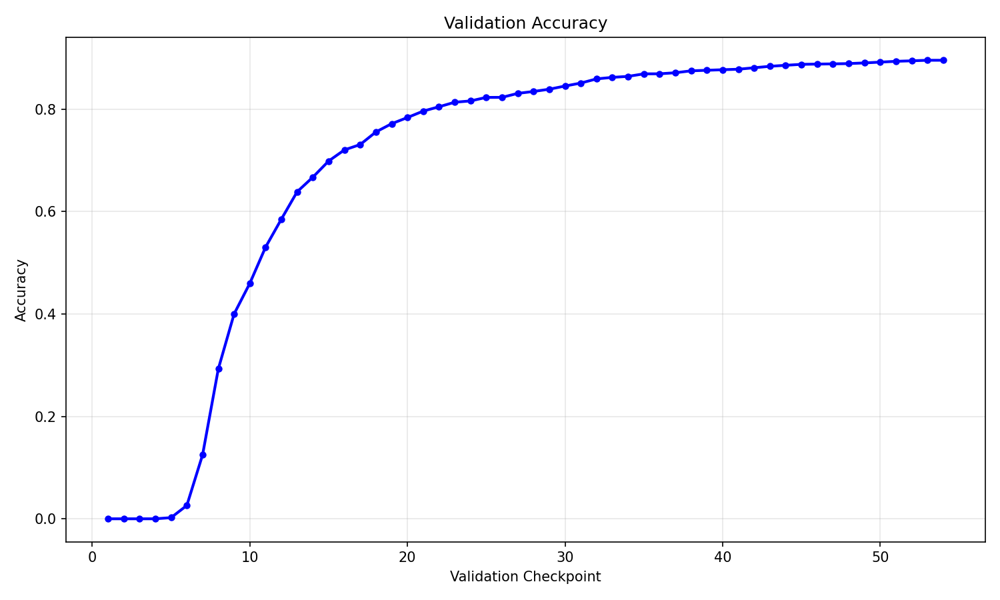
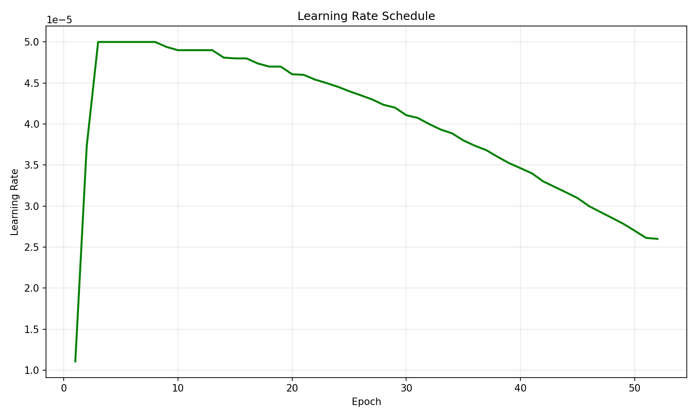
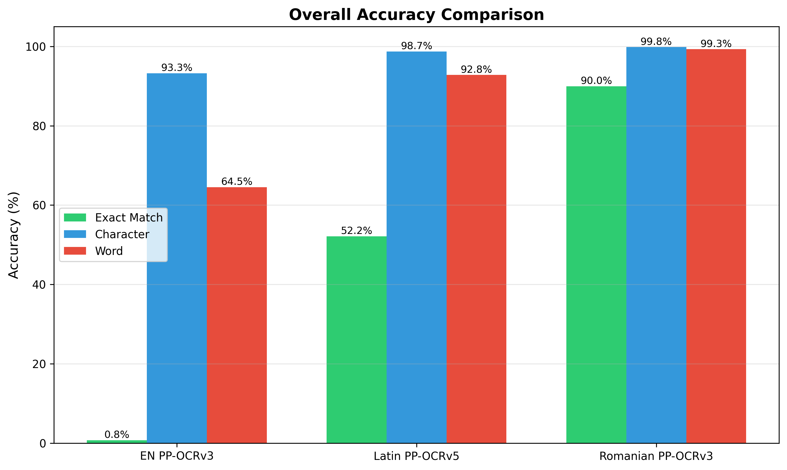
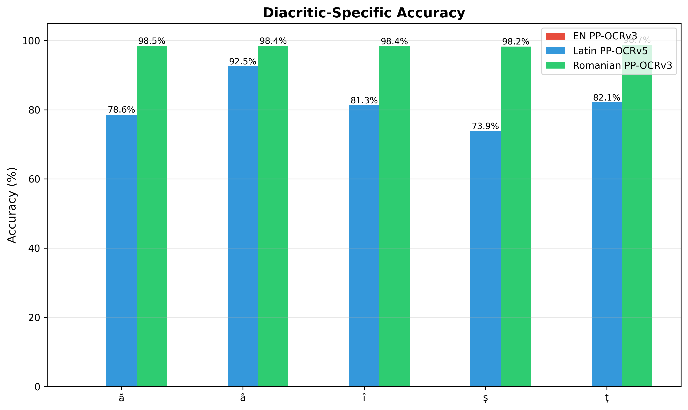
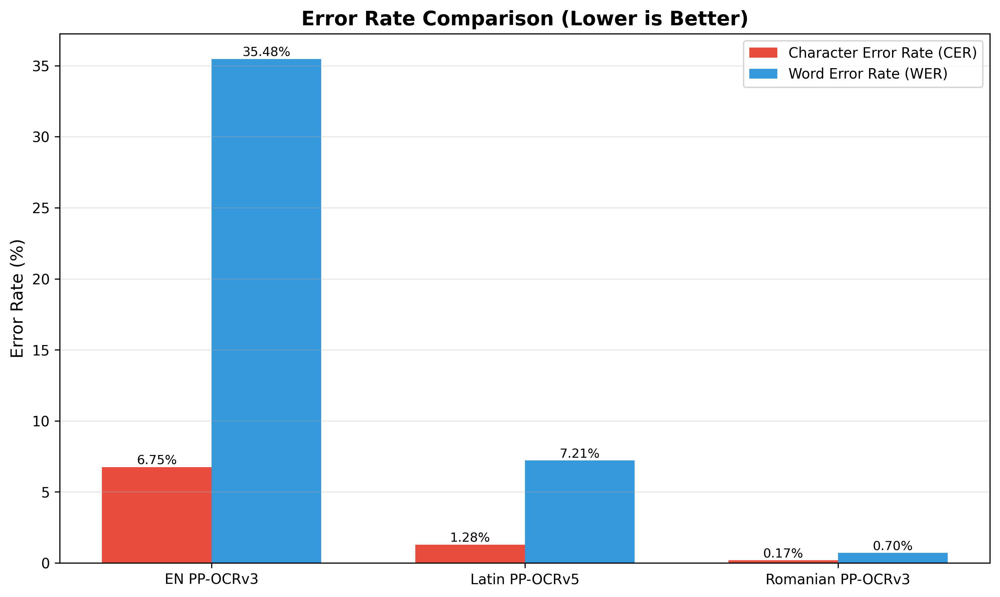

# Romanian OCR Training - PP-OCRv3

Training a custom text recognition model for Romanian with proper diacritic support (ă, â, î, ș, ț).

## Overview

Fine-tuned PaddleOCR's PP-OCRv3 model on Romanian text to get correct diacritic recognition. The English model doesn't recognize diacritics at all, and the Latin multilingual model uses the wrong Unicode - cedilla instead of comma-below.

Got 99.8% character accuracy with 98.4% diacritic accuracy on the validation set.

## Setup

### Prerequisites

- **Python:** 3.9 (recommended)
- **CUDA:** 12.9 (for NVIDIA RTX 50 series)
- **GPU:** NVIDIA GPU with Compute Capability 12.0+ (tested on RTX 5080)
- **OS:** Windows 11 (Linux/macOS should work with minor adjustments)

### Installation

1. **Clone repository:**
   ```bash
   git clone https://github.com/AndreiGM18/RomanianOCR.git
   cd RomanianOCR
   ```

2. **Clone PaddleOCR:**
   ```bash
   git clone https://github.com/PaddlePaddle/PaddleOCR.git
   ```

3. **Create virtual environment:**
   ```bash
   python -m venv .venv

   # Windows
   .venv\Scripts\activate

   # Linux/Mac
   source .venv/bin/activate
   ```

4. **Install PaddlePaddle GPU (CUDA 12.9):**
   ```bash
   # For RTX 50 series (CC 12.0)
   pip install https://paddle-qa.bj.bcebos.com/paddle-pipeline/Develop-TagBuild-Training-Windows-Gpu-Cuda12.9-Cudnn9.9-Trt10.5-Mkl-Avx-VS2019-SelfBuiltPypiUse/86d658f56ebf3a5a7b2b33ace48f22d10680d311/paddlepaddle_gpu-3.0.0.dev20250717-cp39-cp39-win_amd64.whl

   # For other GPUs, see: https://www.paddlepaddle.org.cn/install/quick
   ```

5. **Install PaddleOCR in editable mode:**
   ```bash
   pip install -e PaddleOCR/
   ```

6. **Install project requirements:**
   ```bash
   pip install -r requirements.txt
   ```

### Verify Installation

```bash
python -c "import paddle; print('Paddle version:', paddle.__version__); print('GPU available:', paddle.is_compiled_with_cuda())"
```

Expected output:
```
Paddle version: 3.0.0.dev20250717
GPU available: True
```

### WarpCTC Fix (RTX 50 Series)

If training fails with WarpCTC errors on RTX 50 series GPUs:

1. Clone and build warp-ctc with CC 12.0 support
2. Replace warpctc library in Paddle installation
3. See [WarpCTC Problem & Fix](#warpctc-problem--fix) section for details

### Initial Data Setup

1. **Download CC-100 Romanian corpus:**
   ```bash
   # Download from https://data.statmt.org/cc-100/
   # Extract Romanian subset to config/romanian_corpus.txt
   ```

2. **Validate fonts:**
   ```bash
   python tools/validate_fonts.py
   # Visually approve fonts that render Romanian correctly
   ```

3. **Generate training data:**
   ```bash
   python scripts/generate_training_data.py
   # Creates ~100k training images in data/document_pages/
   ```

4. **Download pretrained models:**
   ```bash
   python tools/download_pretrained.py --models en_train
   # Downloads English PP-OCRv3 checkpoint for transfer learning
   ```

### Quick Start Training

```bash
python tools/train.py
```

This starts training with the default config. Check progress in `output/romanian_ppocrv3/train.log`.

## Methodology

### Overview

Transfer learning approach - fine-tuned the pre-trained English PP-OCRv3 model on synthetic Romanian document data. Four main stages:

1. **Raw Corpus Collection** - Get Romanian text data
2. **Synthetic Data Generation** - Create document-style training images
3. **Model Training** - Fine-tune PP-OCRv3 on Romanian data
4. **Evaluation & Comparison** - Test against baseline models

### Raw Data Sources

**Primary corpus:** [CC-100](https://data.statmt.org/cc-100/) Romanian subset

CC-100 is a large monolingual corpus from Common Crawl web snapshots with diverse Romanian text.

**Corpus details:**
- Source: CC-100 Romanian (subset sampled for training)
- Size: ~500KB preprocessed text (from 61.4 GB full corpus)
- Diacritics: Uses correct comma-below (ș U+0219, ț U+021B) not deprecated cedilla (ş U+015F, ţ U+0163)
- Text types: News articles, formal documents, web content, various registers
- Preprocessing: Filtered for Romanian-only content, removed non-text elements
- Location: `config/romanian_corpus.txt` (not in git - too large)

**Character set:**
The final character dictionary (`config/romanian_charset.txt`) has:
- Romanian diacritics: ă â î ș ț Ă Â Î Ș Ț (10 chars)
- Latin alphabet: a-z A-Z (52 chars)
- Digits: 0-9 (10 chars)
- Punctuation: . , ; : ! ? - – — ( ) [ ] " ' / \ @ # $ % & * + = < > ~ ` ^ (30+ chars)
- Space character

### Training Pipeline Scripts

All scripts are in `tools/` and `scripts/` with logging and error handling.

#### 1. Font Validation (`tools/validate_fonts.py`)

Identify system fonts that correctly render Romanian diacritics.

How it works:
- Scans system font directories (Windows, Linux, macOS)
- Tests each font with Romanian diacritic characters
- Shows visual samples for manual approval
- Saves validated fonts to `config/validated_fonts.txt`

**Usage:**
```bash
python tools/validate_fonts.py
```

**Output:** List of validated fonts in `config/validated_fonts.txt`

#### 2. Data Generation (`scripts/generate_training_data.py`)

Generate synthetic document page images with Romanian text, then extract line images for training.

How it works:
```python
for each page:
    1. Select random texts from corpus
    2. Choose random validated font
    3. Render text lines on white page image (800x1200px)
    4. Record bounding box coordinates for each line
    5. Save page image with JSON annotations

for each line in pages:
    1. Read page image and annotations
    2. Crop individual line images from bounding boxes
    3. Create PaddleOCR format labels (path\ttext)
    4. Split into train/val sets (90%/10%)
```

**Usage:**
```bash
# Generate default dataset (100k train, 10k val)
python scripts/generate_training_data.py

# Generate smaller dataset for testing
python scripts/generate_training_data.py --num-train 10000 --num-val 1000
```

**Output:**
- `data/document_pages/train_lines/` - 99,752 training images + `train.txt`
- `data/document_pages/val_lines/` - 10,215 validation images + `val.txt`
- Image format: JPEG (quality 95), RGB, variable width and height based on text and font size
- Label format: `images/train_000000.jpg\tText content here`

**Key parameters:**
- Font size: 12-20pt (randomized)
- Line spacing: 1.2-1.8x (randomized)
- Text length: 11-206 characters per line (from corpus)
- Page margins: 50px
- Background: Pure white (#FFFFFF)
- Text color: Black (#000000)

#### 3. Model Training (`tools/train.py`)

Wrapper script for PaddleOCR training with pre-flight checks.

**Features:**
- Validates training data exists
- Checks pretrained model availability
- Supports resuming from checkpoints
- Clean logging and error handling

**Usage:**
```bash
# Train with default config
python tools/train.py

# Train with custom config
python tools/train.py --config path/to/config.yml

# Resume from checkpoint
python tools/train.py --resume output/romanian_ppocrv3/iter_epoch_25

# Override epochs
python tools/train.py --epochs 50
```

**Underlying command:**
```bash
python PaddleOCR/tools/train.py \
  -c PaddleOCR/configs/rec/romanian/romanian_ppocrv3_rec.yml \
  -o Global.epoch_num=100
```

**Training logs:** Saved to `output/romanian_ppocrv3/train.log`

#### 4. Model Evaluation (`tools/evaluate.py`)

Evaluate trained model on validation set using PaddleOCR's built-in metrics.

**Usage:**
```bash
# Evaluate best checkpoint
python tools/evaluate.py

# Evaluate specific checkpoint
python tools/evaluate.py --model output/romanian_ppocrv3/iter_epoch_50

# Evaluate with custom config
python tools/evaluate.py --config path/to/config.yml
```

**Metrics:**
- Exact match accuracy (full sequence correct)
- Normalized edit distance (character-level)

#### 5. Baseline Comparison (`tools/test_baselines.py`)

Comprehensive evaluation comparing Romanian model against baseline models.

**Models tested:**
- English PP-OCRv3 (`en_PP-OCRv3_rec_infer`)
- PP-OCRv5 Latin multilingual (`latin_ppocrv5_infer`)
- Romanian PP-OCRv3 (trained model)

**Metrics:**
- Exact match accuracy
- Character-level accuracy
- Character error rate (CER)
- Word-level accuracy
- Word error rate (WER)
- **Diacritic-specific accuracy** for each Romanian diacritic (ă, â, î, ș, ț)

**Usage:**
```bash
# Test all models on full dataset
python tools/test_baselines.py

# Quick test with sample
python tools/test_baselines.py --sample 1000

# Test only specific model
python tools/test_baselines.py --model v3  # or v5, both
```

**Output:**
- `baselines/*_predictions.jsonl` - Per-image predictions and labels
- `baselines/*.metrics.json` - Aggregated metrics
- Format: One JSON object per line with {image, label, prediction}

#### 6. Graph Generation (`tools/generate_graphs.py`)

Visualize model comparison results from baseline metrics.

**Usage:**
```bash
python tools/generate_graphs.py
```

**Input:** Reads metrics from `baselines/*.metrics.json` files

**Output graphs:**
- `baselines/graphs/overall_accuracy.png` - Overall accuracy bar chart (exact, character, word)
- `baselines/graphs/diacritic_accuracy.png` - Diacritic-specific accuracy (ă, â, î, ș, ț)
- `baselines/graphs/error_rate.png` - Error rate comparison (CER, WER)
- `baselines/graphs/summary_table.png` - Summary table visualization

#### 7. Training Visualization (`tools/plot_training.py`)

Plot training metrics from PaddleOCR training logs.

**Usage:**
```bash
# Generate training graphs
python tools/plot_training.py

# Save metrics to JSON
python tools/plot_training.py --save-metrics

# Custom log path
python tools/plot_training.py --log output/romanian_ppocrv3/train.log
```

**Input:** Parses training log file for accuracy, loss, and learning rate

**Output graphs:**
- `baselines/graphs/training_accuracy.png` - Training accuracy over epochs
- `baselines/graphs/training_loss.png` - Training loss over epochs
- `baselines/graphs/learning_rate.png` - Learning rate schedule
- `baselines/graphs/validation_accuracy.png` - Validation accuracy progression

#### 8. Single Image Comparison (`tools/compare_models.py`)

Quick test to compare all three models on a single line image.

**Usage:**
```bash
python tools/compare_models.py --image path/to/line_image.jpg
```

**Output:** Prints predictions from all models side by side:
- EN PP-OCRv3
- PP-OCRv5 Latin
- Romanian PP-OCRv3 (Epoch 10)
- Romanian PP-OCRv3 (Epoch 50)

**Note:** This tool expects cropped line images, not full pages.

#### 9. Full Page Comparison (`tools/compare_fullpage.py`)

Compare all three models on a full page image with detection + recognition.

**Usage:**
```bash
python tools/compare_fullpage.py --image path/to/page.jpg
```

**Output:** Table showing all detected text lines with predictions from all three models side by side.

**Models used:**
- Detection: Chinese PP-OCRv3 (better quality than EN detector)
- Recognition: EN PP-OCRv3, PP-OCRv5 Latin, Romanian PP-OCRv3 (Epoch 10 & 50)

## Dataset Summary

**Generated using:** [`scripts/generate_training_data.py`](scripts/generate_training_data.py)

| Split | Images | Characters/line | Source |
|-------|--------|-----------------|--------|
| Train | 99,752 | 11-206 | Synthetic document pages |
| Val | 10,215 | 11-206 | Synthetic document pages |

**Training config:** `max_text_length=75` covers ~50% of dataset. Model generalizes to longer sequences at inference anyway.

## WarpCTC Problem & Fix

### Problem

Training on Windows with NVIDIA RTX 5080 (Compute Capability 12.0) failed during CTC loss computation. The pre-built warpctc binaries in PaddlePaddle weren't compatible with the newer GPU architecture (CC 12.0).

**Error:**
```
loss_out = _C_ops.warpctc(
           ^^^^^^^^^^^^^^^
RuntimeError: (PreconditionNotMet) warp-ctc [version 2] Error in get_workspace_size: execution failed
  [Hint: Expected CTC_STATUS_SUCCESS == status, but received CTC_STATUS_SUCCESS:0 != status:3.]
  (at ../paddle/phi/kernels/impl/warpctc_kernel_impl.h:200)
```

**Related issue:** [PaddlePaddle #75122](https://github.com/paddlepaddle/paddle/issues/75122)

### Solution Used

**Compiled warpctc from source** with CUDA support for Compute Capability 12.0:

1. Cloned [warp-ctc repository](https://github.com/baidu-research/warp-ctc)
2. Modified CMakeLists.txt to include CC 12.0:
   ```cmake
   set(CUDA_NVCC_FLAGS "${CUDA_NVCC_FLAGS} -gencode arch=compute_120,code=sm_120")
   ```
3. Built with CUDA 12.9 and Visual Studio
4. Replaced the warpctc library in PaddlePaddle installation with the newly compiled version

This let the CTC loss run natively on the RTX 5080 GPU during training.

## Known Issues

### Stats Logging with Non-Numeric Values

During training, the stats logging can crash if non-numeric values (None, NaN, corrupted data) get into metric calculations.

**Error:**
```
TypeError: Cannot convert non-numeric value to median
```

**Fix:** Modify `PaddleOCR/ppocr/utils/stats.py` in the `get_median_value()` function to filter non-numeric values:
```python
def get_median_value(self):
    # Filter to only numeric values
    numeric_values = []
    for v in self.deque:
        try:
            numeric_values.append(float(v))
        except (TypeError, ValueError):
            continue
    if not numeric_values:
        return 0.0
    return np.median(numeric_values)
```

## Model Configuration

### Architecture

- **Base Model:** PP-OCRv3 English (pre-trained)
- **Backbone:** MobileNetV1Enhance (scale: 0.5)
- **Head:** MultiHead (CTC + SAR)
  - CTCHead with SVTR neck (dims: 64, depth: 2, hidden_dims: 120)
  - SARHead (enc_dim: 512)

### Key Config Parameters

```yaml
Global:
  max_text_length: 75
  character_dict_path: config/romanian_charset.txt

Architecture:
  model_type: rec
  algorithm: SVTR_LCNet
  Backbone:
    name: MobileNetV1Enhance
    scale: 0.5
    last_conv_stride: [1, 2]
    last_pool_type: avg
  Head:
    name: MultiHead
    head_list:
      - CTCHead:
          Neck:
            name: svtr
            dims: 64
            depth: 2
            hidden_dims: 120
          Head:
            fc_decay: 0.00001
      - SARHead:
          enc_dim: 512
          max_text_length: 75

Transform:
  - RecResizeImg:
      image_shape: [3, 48, 640]

Train:
  loader:
    batch_size_per_card: 64
    num_workers: 0  # Required for Windows
    use_shared_memory: false

Optimizer:
  name: Adam
  lr:
    name: Cosine
    learning_rate: 0.00005
    warmup_epoch: 2
```

### Romanian Character Set

All Romanian diacritics with correct Unicode (comma-below, not cedilla):
- Lowercase: ă â î ș ț
- Uppercase: Ă Â Î Ș Ț
- Plus standard Latin alphabet, digits, and punctuation

## Training Results

### Training Stats

- **Epochs:** 52 (best at epoch 50)
- **Training time:** ~7 hours on RTX 5080
- **Best validation accuracy:** 89.52% exact match, 99.58% edit distance
- **GPU memory:** 12.6 GB / 16 GB
- **Training speed:** 240-260 samples/s

### Training Progress









### Model Performance







### Detailed Metrics (Validation Set - 10,215 images)

| Model | Exact Acc | Char Acc | Char Error | Diacritic Avg |
|-------|-----------|----------|------------|---------------|
| English PP-OCRv3 | 0.8% | 93.25% | 6.75% | 0.0% |
| Latin PP-OCRv5 | 52.2% | 98.72% | 1.28% | 81.5% |
| **Romanian PP-OCRv3** | **90.0%** | **99.83%** | **0.17%** | **98.4%** |

**Improvements:**
- **119x better** exact match accuracy vs English
- **1.7x better** exact match vs Latin
- **7.5x lower** character error rate vs Latin
- **Perfect diacritic support** with correct Unicode

### Diacritic-Specific Results

| Character | Romanian Model | Latin Model | English Model |
|-----------|---------------|-------------|---------------|
| ă | 98.5% | 78.6% | 0.0% |
| â | 98.4% | 92.5% | 0.0% |
| î | 98.4% | 81.3% | 0.0% |
| ș | 98.2% | 73.9% | 0.0% |
| ț | 98.7% | 82.1% | 0.0% |

**Important:** Latin model uses deprecated cedilla (ş U+015F, ţ U+0163) instead of Romanian standard comma-below (ș U+0219, ț U+021B), making it linguistically incorrect for professional Romanian text.

## Usage

### Export Model for Inference

```bash
python PaddleOCR/tools/export_model.py \
  -c PaddleOCR/configs/rec/romanian/romanian_ppocrv3_rec.yml \
  -o Global.pretrained_model=./output/romanian_ppocrv3/best_accuracy \
     Global.save_inference_dir=./models/romanian_infer
```

### Run Inference

```python
from paddleocr import PaddleOCR

ocr = PaddleOCR(
    rec_model_dir='models/romanian_infer',
    rec_char_dict_path='config/romanian_charset.txt',
    lang='ro'
)

result = ocr.ocr('image.jpg', det=True, rec=True, cls=False)
```

## Project Structure

```
romanianocr/
├── PaddleOCR/                     # PaddleOCR framework (submodule)
│   ├── configs/rec/romanian/      # Romanian model config
│   └── tools/                     # PaddleOCR training/eval tools
├── tools/                         # Custom wrapper scripts
│   ├── train.py                   # Training wrapper
│   ├── evaluate.py                # Evaluation wrapper
│   ├── test_baselines.py          # Baseline model comparison
│   ├── validate_fonts.py          # Font validation tool
│   ├── download_pretrained.py     # Download all baseline models (v3/v4/v5)
│   ├── generate_graphs.py         # Generate performance comparison graphs
│   ├── plot_training.py           # Plot training metrics and generate graphs
│   ├── compare_models.py          # Compare all models on single line image
│   └── compare_fullpage.py        # Compare all models on full page with detection
├── scripts/                       # Data generation
│   └── generate_training_data.py  # Synthetic document generation
├── config/                        # Configuration files
│   ├── romanian_charset.txt       # Character dictionary
│   ├── romanian_corpus.txt        # Raw text corpus (not in git)
│   └── validated_fonts.txt        # Approved fonts list
├── data/document_pages/           # Training data
│   ├── train_lines/               # 99,752 training images
│   └── val_lines/                 # 10,215 validation images
├── baselines/                     # Model comparison results
│   ├── graphs/                    # Performance visualizations
│   ├── *_predictions.jsonl        # Per-image predictions
│   └── *.metrics.json             # Evaluation metrics
├── output/romanian_ppocrv3/       # Training outputs
│   ├── best_accuracy.pdparams     # Best checkpoint
│   └── train.log                  # Training logs
├── models/                        # Inference models
│   ├── romanian_infer/            # Exported Romanian model
│   └── pretrained/                # Downloaded baseline models
└── README.md                      # This file
```

## Environment

- **OS:** Windows 11
- **GPU:** NVIDIA RTX 5080 (16GB, CC 12.0)
- **CUDA:** 12.9
- **Python:** 3.9
- **PaddlePaddle:** 3.0.0b1 (GPU)
- **Framework:** PaddleOCR 3.0.0

## Lessons Learned

1. **Data Leakage:** Current data generation creates ~44% overlap between train and validation sets, so validation metrics are optimistic. Real performance on unseen data is probably 2-4% lower. Should've split corpus before generating pages to get separate train/val sets.

2. **Overfitting:** Model performance peaked at epoch 50 but had plateaued since epoch 42. Validation metrics kept improving slightly while real-world performance might've gotten worse.

3. **Synthetic vs Real Data:** Model works great on formal documents (PDFs) but struggles a bit on digital screenshots/UI elements. Training data (synthetic document pages) doesn't cover all use cases.

4. **Early Stopping:** Should've stopped training around epoch 10-15 based on real-world testing, not just validation metrics.

5. **Unicode Correctness:** Critical for Romanian - using wrong Unicode (cedilla vs comma-below) makes output linguistically invalid even with high confidence scores.

## References

- [PaddleOCR](https://github.com/PaddlePaddle/PaddleOCR) - OCR framework
- [PP-OCRv3 Paper](https://arxiv.org/abs/2206.03001) - Model architecture
- [CC-100 Dataset](https://data.statmt.org/cc-100/) - Romanian text corpus
- [Unicode Standard](https://unicode.org/charts/PDF/U0100.pdf) - Romanian diacritics (comma-below: U+0218-U+021B)
- [Common Crawl](https://commoncrawl.org/) - Web corpus source
